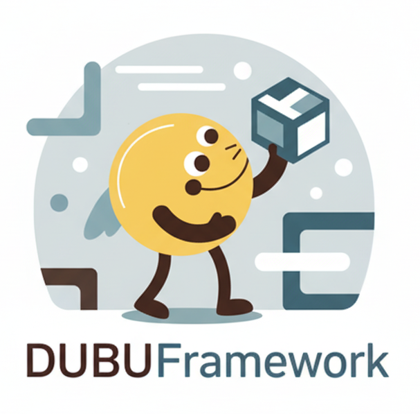
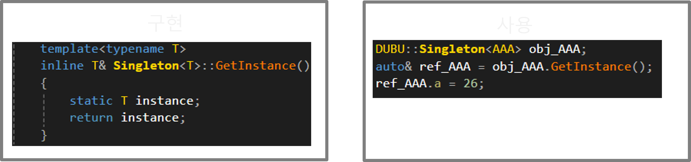
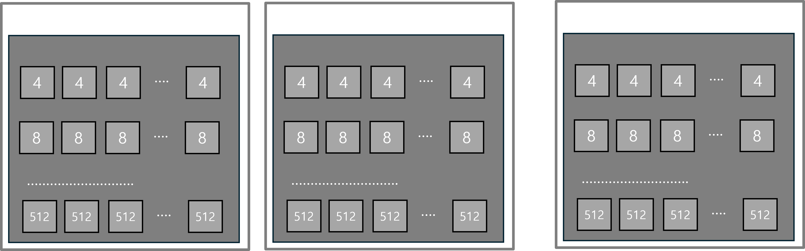
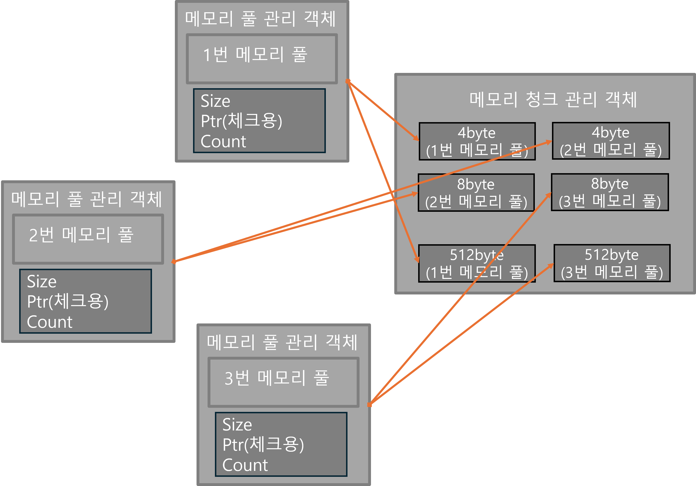
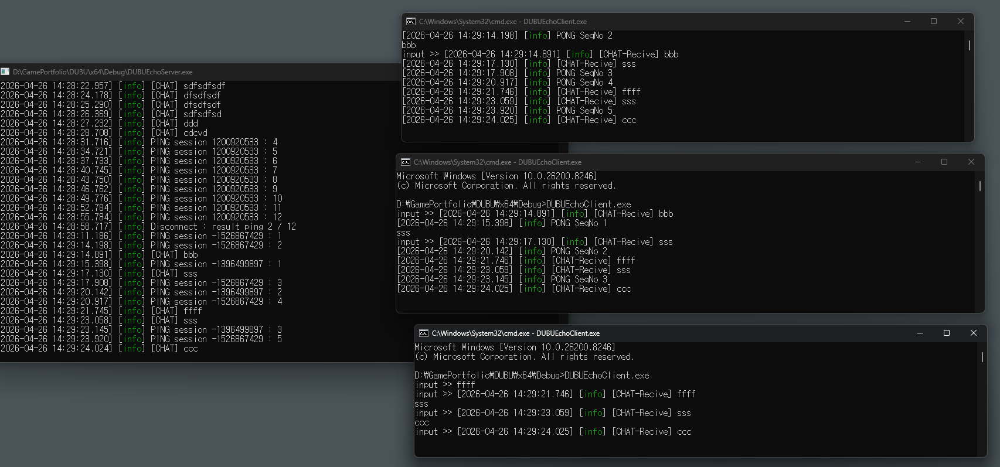

# DUBUFramework

DUBUFramework는 **C++** 기반의 서버 애플리케이션 개발에 필요한 **핵심 도구 및 고성능 기능**을 제공하는 프레임워크입니다. 이 프레임워크는 서버 환경에서 요구되는 성능, 안정성 및 테스트, 개발 환경을 목표로 설계되었습니다.

## 주요 특징 (Features)

DUBUFramework는 다음과 같은 서버 최적화 기능을 제공합니다:

- **Singleton Pattern:** 전역적으로 유일한 인스턴스를 보장하는 디자인 패턴 구현.
- **Memory Pool:** 메모리 할당 및 해제의 오버헤드를 줄여 고성능을 확보하기 위한 커스텀 메모리 관리 기법.
- **RUDP:** 채팅 구현(flatbuffer) - 추가기능 확장 예정
- **Flatbuffer:** 실시간 통신, 온라인 게임등에서 사용하기 위해 데이터 송수신시 패킹/언패킹이(ZeroCopy) 필요없으므로 기본으로 선택
- **vcpkg 환경:** 독립적으로 모듈 관리

## 구현 내용 (Detaile)

### 모든 전역 변수, 전역 함수, 클래스등 중복을 피하기 위해 **namespace DUBU**내부에 선언

### SingleToon

- SingleToon을 사용하려는 클래스의 재사용성과 결합도를 낮추기 위해 Template를 사용한 SingleToon구현
- 기본적인 싱글톤 구현의 `new를 제거`하고 `static 정적변수`와 `참조`를 이용해 `heap 메모리 할당 제거`, `생성자 호출시점`을 처음 사용할때로 지정
  

### Memory Pool

- 객체를 생성하기 위해 매번 동적할당을 하는 성능하락을 막기 위해 구현
- 기본 구성은 큰 메모리를 `미리 할당`하고 `잘라서 일정한 크기`(4,8,12~512)로 자르고 비율에 맞게 Map에서 관리 / 만약 원하는 크기의 공간이 없으면 `추가적으로 메모리 풀을 할당`하는 방식
  
- 메모리 풀을 관리하는 객체는 `전체크기(size)`, `ptr(메모리풀 시작 주소)`, `Count(할당된 개수)`로 관리
- 메모리가 객체에 할당 or 할당 해제될때 `Count를 체크하기 위해 ptr변수`로 순차적으로 list로 탐색해서 관리객체를 찾는다.
  

### RUDP

RUDP를 구현은 TCP의 신뢰성·순서·흐름·혼잡제어를 모든 패킷에 적용되어야 되므로, 패킷별로 꼭 필요한 패킷들만 신뢰성으로 전송하기 위해서 사용. 즉 빠른 반응성을 가진 UDP를 사용

- **Header**: sequenceNo · timestamp · CRC32 · flag 포함 — 패킷 단위로 신뢰성 옵션 선택
- **비신뢰성 통신**: 이동·회전 등 손실 감수 패킷
- **신뢰성 통신**: PendingPacket 큐 보관 → ACK 수신 시 제거, 미수신이면 재전송(A -> B -> A)

### vcpkg 환경 셋팅

프로젝트 내부에 독립적인 vcpkg에서 라이브러리 모듈 로드

- `externals/vcpkg` (submodule) + 매니페스트 모드로 독립적 종속성 관리
- `vcpkg.json` 에 라이브러리 등록 → MSBuild 빌드 시 자동 복원
- 라이브러리 버전을 고정해서 누가 언제 클론해도 동일한 빌드

## 사용 라이브러리 (Dependencies)

DUBUFramework는 다음과 같은 검증된 외부 라이브러리에 의존합니다:

- **FlatBuffers (v25.9.23):** 빠르고 효율적인 직렬화(Serialization) 라이브러리.
- **Boost (v1.89.0):** C++ 표준 라이브러리를 보완하고 서버 개발에 유용한 다양한 유틸리티를 제공하는 라이브러리 모음.

## 시작하기 (Getting Started)

### 필수 조건 (Prerequisites)

- **C++ 컴파일러:** C++20 이상을 지원하는 컴파일러 (예: GCC, Clang, MSVC)
- **vcpkg**: flatbuffer, asio(boost빌드 대신 standalone버전), nlohmann, spdlog 설치

## vcpkg 셋팅

### 빌드 순서

- git submodule init
- git submodule sync
- git submodule update --init --recursive

- 위 명령어가 안될시 직접한다
  - mkdir externals & mkdir externals\vcpkg
  - cd externals\vcpkg
  - git init
  - git remote add origin https://github.com/microsoft/vcpkg.git
  - git fetch origin
  - git checkout master
  - cd ..\..

- externals\vcpkg\bootstrap-vcpkg.bat : vcpkg 빌드
- externals\vcpkg\vcpkg.exe integrate install : 비주얼 스튜디오 연동
- sln파일 열어서 빌드하고 vcpkg_installed 폴더 생기면 성공

## 테스트 (Testing)

DUBUFramework는 안정적인 개발을 위해 **테스트 주도 개발(TDD)** 방식을 채택하고 있습니다.

- **테스트 프레임워크:** **Google Test**
- **DUBUTest:** **Google Test**를 이용하는 프로젝트폴더
- **현재는 멀티스레드 공유변수 동기화 체크, flatbuffer로 패킷 생성만 체크**
- **DUBUEchoServer / DUBUEchoClient** 채팅 구현 프로젝트 사용가능

  

## 추가 구현 예정

- **RUDP:** 최적화 고도화 예정
